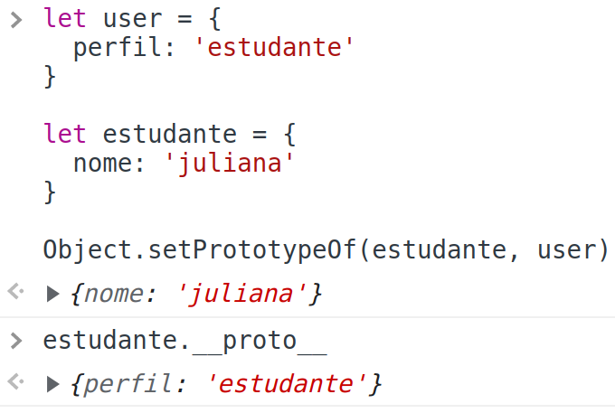
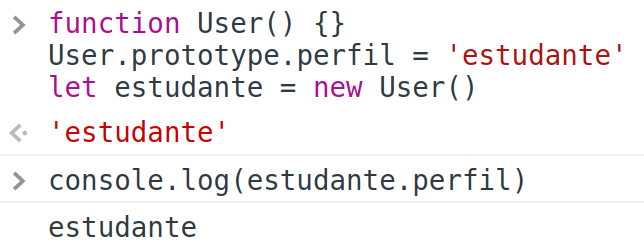

# __proto__ vs prototype

Durante nossos estudos de JavaScript é normal toparmos com os protótipos de duas formas diferentes, através da propriedade `__proto__` ou do objeto `prototype` que vemos em todos os objetos. Afinal, qual a diferença e quando se usa cada um deles?

Para entender melhor essa diferença, vamos testar alguns códigos:

```javascript
let user = {
 perfil: 'estudante'
}

let estudante = {
 nome: 'juliana'
}

Object.setPrototypeOf(estudante, user)
```

No trecho acima, definimos dois objetos, com propriedades diferentes, e estabelecemos que o objeto `user` será usado como protótipo para o objeto `estudante`. Podemos testar esse código direto no terminal:

```javascript
console.log(estudante.nome) // 'juliana'
console.log(estudante.perfil) //'estudante'
```

Ou seja, o objeto `estudante`, além da propriedade `nome`, também tem a propriedade `perfil`, trazida do protótipo `user`.

É possível acessar `__proto__` de `estudante`, porém, para isso, devemos copiar o código acima e executá-lo no console do navegador, pois o módulo `console` do NodeJS funciona de uma forma um pouco diferente e não vai acessar essa propriedade.



Se adicionarmos mais uma propriedade ao objeto `user`, essa propriedade entrará também como protótipo do objeto `estudante`:


Quando usamos objetos e funções para trabalhar com orientação a objetos com JavaScript, os objetos criados não são instâncias diferentes (ou seja, cópias do objeto-base) e sim **referências** a um mesmo objeto que está sendo delegado aos objetos que o usam como protótipo.

Agora vamos ver outro exemplo, dessa vez utilizando **new** para criar um novo objeto:

```javascript
function User() {}
User.prototype.perfil = 'estudante'
let estudante = new User()
```

Testando no próprio terminal:

```javascript
console.log(estudante.perfil) //'estudante'
```

No caso acima, a palavra-chave `new` vai criar um novo objeto simples e definir, na propriedade `prototype` desse objeto recém criado, as propriedades de protótipo que encontrar em `User`. O `prototype` é criado automaticamente e existe como propriedade apenas em funções, para quando queremos usar determinada função como construtor usando `new`.

Vamos fazer um último teste, copiando a função `User()` criada acima e executando no console do navegador:



Se tentarmos acessar as propriedades `prototype` e `__proto__` de estudante, obtemos os seguintes retornos:


Em resumo:

> `__proto__` é uma propriedade que todos os objetos têm e que aponta para o protótipo que foi definido para aquele objeto.

> `prototype` é uma propriedade da função que é definida como protótipo quando usamos `new` para criar novos objetos.

Você também pode ter notado que alguns objetos também possuem uma propriedade chamada `[[Prototype]]`. Esta é uma propriedade interna que cada instância de um objeto possui, e que aponta (como um ponteiro) para a propriedade `prototype` da função que está sendo usada como protótipo. Quando criamos um novo objeto usando `new`, a propriedade `prototype` do construtor (como vimos acima) é “linkada” à essa propriedade `[[Prototype]]` da nova instância criada.

Existem diversos métodos internos do JavaScript para verificar as propriedades de um construtor e também das instâncias criadas através dele. Você pode conferir a lista na [documentação do MDN](https://developer.mozilla.org/pt-BR/docs/Web/JavaScript/Reference/Global_Objects/Object).

Faça mais testes criando objetos a partir de funções construtoras e confira o resultado!